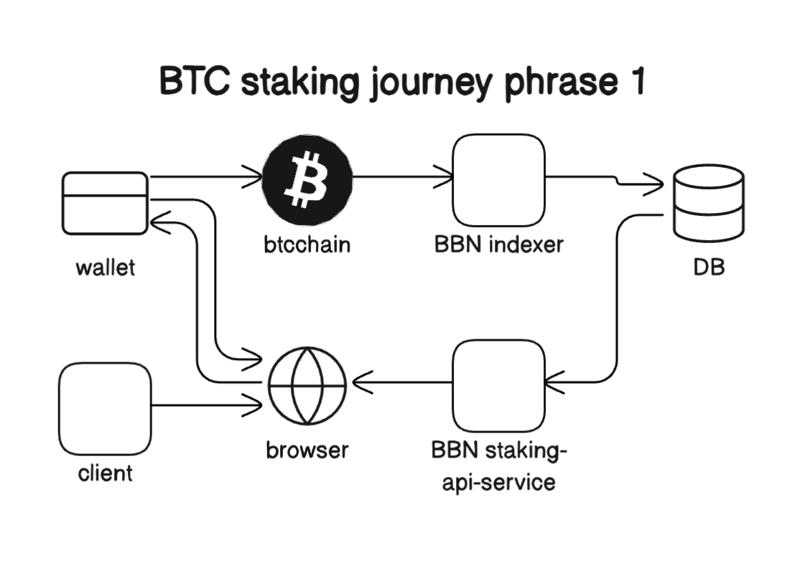
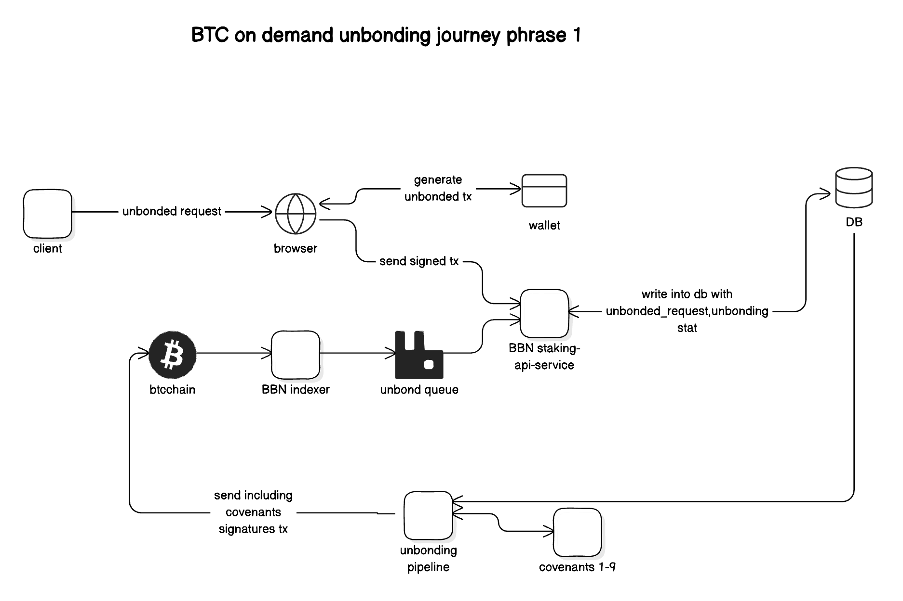
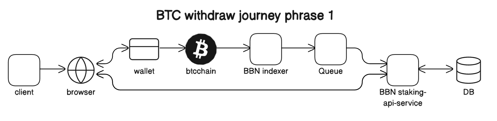
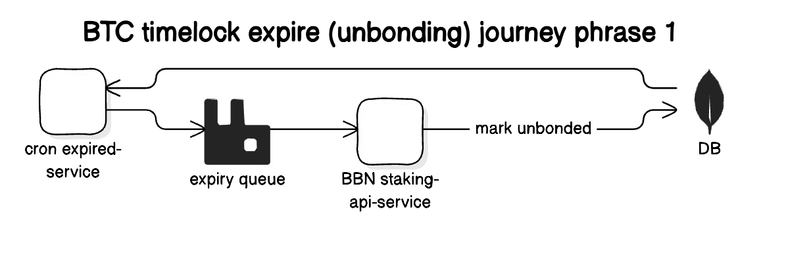

# BTC Staking Phase-1 deployment (BTC backend: bitcoind)

## Components

The system that emulates Babylon's Phase-1 Mainnet network
comprises the following components:

- **BTC Staking Indexer**: Parses BTC blocks and forwards BTC Staking
  transactions to a queueing system, while also persisting them to an on-disk
  key-value storage
- **RabbitMQ**: Houses a set of queues containing BTC Staking transactions
- **Staking API Service**: Consumes BTC Staking transactions from the RabbitMQ
  queues and stores them in a central data store, additionally accepting
  unbonding requests
- **Mongo DB**: Stores BTC Staking transaction data
- **Staking Expiry Checker**: Periodically checks MongoDB for expired BTC
  Stake Delegations and Unbondings
- **Unbonding Pipeline**: Forwards unbonding requests for signing to a Covenant
  Emulator committee and submits them to BTC
- **Staking Dashboard**: UI that allows for creating BTC Staking transactions,
  connects to the API to retrieve information about the system and historical
  delegations
- **Covenant Signer**: Receives unbonding transactions and returns the same
  transactions signed by the covenant emulator's key
- **Bitcoin Full Node**: Operates an emulated **regtest Bitcoin** network
- **Bitcoin Offline Wallet**: Stores the Covenant Signer member keys and signs
  unbonding transactions forwarded by the Covenant Signer
- A **Global Configuration** file that contains system-wide parameters pertinent
  to the processed Staking transactions
- A **Finality Provider** config file that contains information about finality
  providers participating in the system 

### Expected Docker state post-deployment

The following containers should be created as a result of the `make` command
that spins up the network:

```shell
[+] ✔ Network artifacts_phase-1         Created                                                       0.1s 
 ✔ Container bitcoindsim             Started                                                       0.6s 
 ✔ Container mongodb                 Started                                                       0.4s 
 ✔ Container rabbitmq                Started                                                       0.5s 
 ✔ Container staking-indexer         Started                                                       1.0s 
 ✔ Container staking-api-service     Started                                                       1.0s 
 ✔ Container unbonding-pipeline      Started                                                       1.3s 
 ✔ Container staking-expiry-checker  Started                                                       1.0s 
 ✔ Container simple-staking          Started                                                       1.7s
 ✔ Container bitcoindsim-signer      Started                                                       1.0s
 ✔ Container covenant-signer         Started                                                       1.0s   
```

## Inspecting the BTC Staking Phase-1 system demo

Deploying the BTC Staking Phase-1 system through the
`make start-deployment-btcstaking-phase1-bitcoind-demo` subcommand leads to the
execution of an additional post-deployment [script](btcstaking-demo.sh) that
showcases the lifecycle of Staking, Unbonding and Withdraw operations inside the
Phase-1 system in conjunction with its Global Configuration.

We will now analyze each step that is executed as part of the showcasing
script - more specifically, how it is performed and its outcome for the system.

### Preface: The Demo Global Configuration

The Global Configuration includes a series of versioned governance parameters
that greatly affect the behaviour of the system. Detailed information can be
found
[here](https://github.com/babylonchain/networks/tree/main/bbn-test-4/parameters).

The Demo Global Configuration can be found [here](artifacts/global-params.json).
Below, we briefly mention some parameters that are critical for the
behaviour of this demonstation:
- **Version**: Defines a version of the governance parameters
- **Activation height**: Defines the BTC height from which a specific version of
  the global parameters kicks in
- **Staking cap**: Defines the maximum amount of active BTC stake that the system
  can accommodate
- **Min / Max staking amount**: Defines the minimum / maximum BTC stake that can
  be included in a single staking transaction
- **Confirmation depth**: The amount of BTC confirmations that a staking
  transaction has to gather before being processed by the system

For this demo, we define a Global Configuration with 2 versions:
- Version 0:
  - Activation height: `115`
  - Staking cap: `10 BTC`
  - Min / Max staking amount `1 / 10 BTC`
  - Confirmation depth: `2 blocks`
- Version 0:
  - Activation height: `130`
  - Staking cap: `20 BTC`
  - Min / Max staking amount `2 / 20 BTC`
  - Confirmation depth: `2 blocks`

### Scenario 1: No transactions are processed by the system before the first activation height

The Staking Indexer service will only process transaction that are included in
BTC after the initial activation height, as stated in the `v0` of the staking
parameters.

To verify this, we send a transaction before the first activation height (115)
to the system.

#### Step by Step Details:

* At height 111, we send 1 staking transaction with stake 6 BTC
* At height 113, we verify that the Staking Indexer disregarded it by checking
  its Prometheus metric counter for staking transactions (should be zero)

#### Sample Output

```log
===== ### Scenario 1: No transactions are processed by the system before the first activation height ===== 
Sign and send a staking transaction with stake: 6 BTC and staking term: 1000 blocks
Staking transaction submitted to bitcoind regtest with tx ID:  e2eb30489c4e377d86cbaa80c110cf5e84c95d1909ca8f035b5a5609c75cc556 
Next bitcoin block will be produced in 10 seconds...
 Current Height 112 
Next bitcoin block will be produced in 10 seconds...
 Current Height 113 
 Target metrics achieved! Invalid transaction count on Staking Indexer: 0 
 Target metrics achieved! Active delegation count: 0 
 Target metrics achieved! Total delegation count: 0
```

### Scenario 2: Submit Staking Transactions and fill the staking cap

We generate BTC staking transactions and send it to the Bitcoin regtest chain.
Once the transactions receives enough confirmations (2), they're processed by
the Staking Indexer and placed in the corresponding RabbitMQ queue.

The Staking API Service is listening to this queue; as soon as the transaction
appears, it will be consumed and inserted to the MongoDB, with `active` status.

After the system's active BTC TVL reaches the staking BTC cap, all incoming
staking transactions are marked as `overflow` by the Staking API and can never
be activated. These transactions can still be unbonded and withdrawn.



#### Step by Step Details:

* At height 115, we send 2 staking transactions with stake 2 BTC and 8 BTC
* At height 116, we send 1 staking transaction with stake 1 BTC
* At height 117, both the initial transactions are active with total active
  stake 10 BTC; the staking cap is filled
* At height 118, the latter transaction will be marked as overflow due to the
  staking cap being filled

#### Sample Output

```log
===== Scenario 2: Submit Staking Transactions and fill the staking cap ===== 
Generating enough bitcoin blocks to reach bitcoin height 115...
 Reached target bitcoin height 115 
Sign and send a staking transaction with stake: 2 BTC and staking term: 1000 blocks
Staking transaction submitted to bitcoind regtest with tx ID:  87eb840ffa67480c515662a9e63d550bc748df0511465ad441e028d25779f42b 
Sign and send a staking transaction with stake: 8 BTC and staking term: 1000 blocks
Staking transaction submitted to bitcoind regtest with tx ID:  67fb73196d900d5932e3a25e9ec65c85c2b04783a187d671b74ecec24c358af6 
Next bitcoin block will be produced in 10 seconds...
 Current Height 116 
Sign and send a staking transaction with stake: 1 BTC and staking term: 1000 blocks
Staking transaction submitted to bitcoind regtest with tx ID:  f782cb1df71e25b249ee2bcabbd9dd08f782f15ac1132cadca665161771cad90 
Next bitcoin block will be produced in 10 seconds...
 Current Height 117 
Checking transaction with ID: 87eb840ffa67480c515662a9e63d550bc748df0511465ad441e028d25779f42b 
 Target metrics achieved! Transaction state: active and Overflow status: false 
Checking transaction with ID: 67fb73196d900d5932e3a25e9ec65c85c2b04783a187d671b74ecec24c358af6 
 Target metrics achieved! Transaction state: active and Overflow status: false 
Next bitcoin block will be produced in 10 seconds...
 Current Height 118 
Checking transaction with ID: f782cb1df71e25b249ee2bcabbd9dd08f782f15ac1132cadca665161771cad90 
 Target metrics achieved! Transaction state: active and Overflow status: true 
 Target metrics achieved! Active delegation count: 2 
 Target metrics achieved! Total delegation count: 2 
```

### Scenario 3: Submit on-demand unbonding transaction and ensure the system re-opens

We generate a BTC unbonding transaction for a previous staking transaction
and we send it to the Staking API Service. The API saves it to a MongoDB
collection containing unbonding requests, and transitions the delegation state
to `unbonding_requested`.

The unbonding pipeline periodically polls this collection, so subsequently it
retrieves it and submits it to the Covenant Signer to obtain signatures
until the Covenant Quorum (2 signatures for this demonstration, retrieved from
the global parameters) is reached. For our demonstration purposes, one Covenant
Signer instance represents all the Covenant entities.

The Covenant Signer in turn forwards the transaction to the Bitcoind Offline
Wallet, which again for demonstration purposes hosts all the Covenant BTC keys.
The Bitcoind Offline Wallet signs the transaction which is then
returned to the unbonding pipeline. The unbonding pipeline finally submits it
to the Bitcoin regtest chain.

When the unbonding transaction for the **active** staking transaction is included
in a BTC block, the following events will occur:
- Its stake will be subtracted both from the active TVL and the pending TVL
- The staking will be re-enabled again, as the active TVL is again below the
  staking cap

This reopens space for staking transactions as we're again below the staking
cap. We verify that this is the case by submitting a new staking transaction.

After the unbonding transaction receives enough confirmations (2), the Staking
Indexer forwards it to the Staking API Service through the method described
before. The Staking API Service updates the delegation state to `unbonding`.

After the unbonding time in BTC blocks elapses (3 blocks for this
demonstration, retrieved from the global parameters), the Staking Expiry Checker
processes the transaction and sends it to the corresponding RabbitMQ queue.
Finally, the Staking API Service retrieves the event and updates the
delegation state to `unbonded`.



#### Step by Step Details:

* At height 119, we unbond the BTC delegation with stake 2 BTC
* At height 120:
  * The unbonding delegation status shifts to `unbonding`
  * The active TVL falls to 8 BTC
  * We send a new staking transaction with stake 1 BTC
* At height 122:
  * The unbonding time elapses and the unbonding transaction status shifts to
    `unbonded`
  * The new staking transaction is active

#### Sample Output

```log
===== Scenario 3: Submit on-demand unbonding transaction and ensure the system re-opens ===== 
Next bitcoin block will be produced in 10 seconds...
 Current Height 119 
{
    "staking_tx_hash_hex": "87eb840ffa67480c515662a9e63d550bc748df0511465ad441e028d25779f42b",
    "unbonding_tx_hex": "02000000012bf47957d228e041d45a461105df48c70b553de6a96256510c4867fa0f84eb870000000000ffffffff010cc0eb0b00000000225120e3c89f82614aad82519620e92b797e52a0d27c7fb677f5f299f86642d95c863200000000",
    "unbonding_tx_hash_hex": "97e5a577f673bbae945b3553d3c4a76c38db54492b754a1fbaeee559971bb943",
    "staker_signed_signature_hex": "00c9a6590718afcee2b563b268e236eec6498a7b780b735d08f980dec4f397554621143e6c03dcecb2bd39d4e4f31fe54f73f69dfa1a60e64dbdf06a00a835f5"
}
null
Checking transaction with ID: 87eb840ffa67480c515662a9e63d550bc748df0511465ad441e028d25779f42b 
 Target metrics achieved! Transaction state: unbonding_requested and Overflow status: false 
Next bitcoin block will be produced in 10 seconds...
 Current Height 120 
Checking transaction with ID: 87eb840ffa67480c515662a9e63d550bc748df0511465ad441e028d25779f42b 
 Target metrics achieved! Transaction state: unbonding and Overflow status: false 
get unbonding tx in mongo:  87eb840ffa67480c515662a9e63d550bc748df0511465ad441e028d25779f42b 
 Target metrics achieved! Active delegation count: 1 
 Target metrics achieved! Total delegation count: 2 
Sign and send a staking transaction with stake: 1 BTC and staking term: 1000 blocks
Staking transaction submitted to bitcoind regtest with tx ID:  d4707849cff714b6c346e4f7010b6848238e695742b477563f86aebdfff04368 
Next bitcoin block will be produced in 10 seconds...
 Current Height 123 
Next bitcoin block will be produced in 10 seconds...
 Current Height 124 
Checking transaction with ID: d4707849cff714b6c346e4f7010b6848238e695742b477563f86aebdfff04368 
 Target metrics achieved! Transaction state: active and Overflow status: false 
Next bitcoin block will be produced in 10 seconds...
 Current Height 125 
Checking transaction with ID: 87eb840ffa67480c515662a9e63d550bc748df0511465ad441e028d25779f42b 
 Target metrics achieved! Transaction state: unbonded and Overflow status: false 
```

### Scenario 4: Withdraw an on-demand unbonded transaction

We generate a BTC withdraw transaction for the previously unbonded transaction
for which the unbonding time has elapsed and send it to the Bitcoin regtest
chain. Once the transaction receives enough confirmations, it's processed by the
Staking Indexer and placed in the corresponding RabbitMQ queue.

The Staking API Service retrieves the event and updates the delegation state
to `withdrawn` in MongoDB.



* At height 123, we withdraw the unbonded staking transaction
* At height 125, the withdrawal transaction is processed by the system

#### Sample Output

```log
===== Scenario 4: Withdraw an on-demand unbonded transaction ===== 
Next bitcoin block will be produced in 10 seconds...
 Current Height 126 
Send the withdrawal transactions to bitcoind regtest
Withdrawal transaction submitted to bitcoind regtest with tx ID  8870447161148236e0abb47990dfd0bc52488661f78eb6f8761e1c8528ef1a59 
Next bitcoin block will be produced in 10 seconds...
 Current Height 127 
Checking transaction with ID: 87eb840ffa67480c515662a9e63d550bc748df0511465ad441e028d25779f42b 
 Target metrics achieved! Transaction state: withdrawn and Overflow status: false 
 Target metrics achieved! Active delegation count: 2 
 Target metrics achieved! Total delegation count: 3 
```

### Scenario 5: Ensure staking parameter update is enforced

When the BTC height of the Bitcoin regtest network reaches 130, the second
(`v1`) version of the global parameters takes effect. As demonstrated before,
in the second version the minimum BTC stake is bumped to 2 BTC. Thus, a staking
transaction adhering to the previous minimum (1 BTC) but not to the new one
should be rejected.

We send a staking transaction of 1.5 BTC to verify this behaviour. The Staking
Indexer is the entity that will filter out the transaction and increment the
corresponding Prometheus metric counter.

#### Step by Step Details:

* At height 130, we submit a staking transaction with stake 1.5 BTC
* At height 132, the Staking Indexer spots the staking transaction and marks
  it as invalid

#### Sample Output

```log
===== Scenario 5: Ensure staking parameter update is enforced ===== 
Generating enough bitcoin blocks to reach bitcoin height 130...
 Reached target bitcoin height 130 
Current Active Global Parameters
{
  "version": 1,
  "activation_height": 130,
  "staking_cap": 2000000000,
  "tag": "62627434",
  "covenant_pks": [
    "0342301c4fdb5b1ab27a80a04d95c782f720874265889412a80d270feeb456f1f7",
    "03a4d2276a2a09f0e14d6a74901fec0aab3d1edf0dd22a690260acca48f5d5b3c0",
    "02707f3d6bf2334ecb7c336fc7babd400afa9132a34f84406b28865d06e0ba81e8"
  ],
  "covenant_quorum": 2,
  "unbonding_time": 3,
  "unbonding_fee": 500,
  "max_staking_amount": 2000000000,
  "min_staking_amount": 200000000,
  "max_staking_time": 5000,
  "min_staking_time": 1,
  "confirmation_depth": 2
}
Sign and send a staking transaction with stake: 1 BTC and staking term: 1000 blocks
Staking transaction submitted to bitcoind regtest with tx ID:  dc0b74a300ee70d78e7211e66bbed460c709f90cb24014be3968bf04503bc348 
Next bitcoin block will be produced in 10 seconds...
 Current Height 131 
Next bitcoin block will be produced in 10 seconds...
 Current Height 132 
 Target metrics achieved! Invalid transaction count on Staking Indexer: 1 
```

### Scenario 6: Withdraw a transaction that has exceeded its timelock

The Staking Expiry Checker service will periodically check all staking
transactions for expired timelock periods. Transactions that qualify are sent to
the Staking API Service through a dedicated queue. This results in the
transaction state being updated to `unbonded`.

Similar to Scenario 4, we can now unbond this transaction.



#### Step by Step Details:

* At height 133, we create a staking transaction with stake 5 BTC and a short
  timelock (2 blocks)
* At height 135, the timelock has already expired; the Staking Expiry Checker
  identifies this and initiates a state update to `unbonded`
* At height 136, we withdraw this staking transaction
* At height 138, the withdrawal transaction is processed by the system

#### Sample Output

```log
===== Scenario 6: Withdraw a transaction that has exceeded its timelock ===== 
Next bitcoin block will be produced in 10 seconds...
 Current Height 133 
Sign and send a staking transaction with stake: 5 BTC and staking term: 2 blocks
Staking transaction submitted to bitcoind regtest with tx ID:  af7d6872f18507fc40faa4fe12c03addbabd552726d4bd1eab7582787035b05a 
Next bitcoin block will be produced in 10 seconds...
 Current Height 134 
 Target metrics achieved! Active TVL: 900000000 
 Target metrics achieved! Total TVL: 1100000000 
 Target metrics achieved! Unconfirmed TVL: 1400000000 
Next bitcoin block will be produced in 10 seconds...
 Current Height 135 
Checking transaction with ID: af7d6872f18507fc40faa4fe12c03addbabd552726d4bd1eab7582787035b05a 
 Target metrics achieved! Transaction state: unbonded and Overflow status: false 
 Target metrics achieved! Active TVL: 1400000000 
 Target metrics achieved! Total TVL: 1600000000 
 Target metrics achieved! Unconfirmed TVL: 1400000000 
Next bitcoin block will be produced in 10 seconds...
 Current Height 137 
Send the withdrawal transactions to bitcoind regtest
Withdrawal transaction submitted to bitcoind regtest with tx ID  12ce64b16c11bc90008a0224334427c96cece077ef22dadf0ea11cd8f483962f 
Next bitcoin block will be produced in 10 seconds...
 Current Height 138 
Checking transaction with ID: af7d6872f18507fc40faa4fe12c03addbabd552726d4bd1eab7582787035b05a 
 Target metrics achieved! Transaction state: withdrawn and Overflow status: false 
 Target metrics achieved! Active delegation count: 3 
 Target metrics achieved! Total delegation count: 4 
```

### Scenario 7: Ensure the system can survive BTC forks

A transaction submitted into an
[uncle block](https://coinmarketcap.com/academy/glossary/uncle-block-ommer-block)
should still be processed by our system once the re-org has been completed.

We ensure that by manually creating a re-org of 1 BTC block.

#### Step by Step Details:

* At height 140, we send a staking transaction with 7 BTC stake
* At height 141, transaction record in block 141, then use btc cli to invalid this block, make it uncle.
* At height 141:
  * The transaction is included in a BTC block
  * The block is invalidated and a new one is created, resulting in a re-org of
    1 block
* At height 142, we verify that the transaction is still processed by the system
  and marked as `active`

#### Sample Output

```log
===== Scenario 7: Ensure the system can survive BTC forks ===== 
Generating enough bitcoin blocks to reach bitcoin height 140...
 Reached target bitcoin height 140 
Sign and send a staking transaction with stake: 7 BTC and staking term: 1000 blocks
Staking transaction submitted to bitcoind regtest with tx ID:  49b4b101f343d81706e08bd4ece80a0ed97aa6bfe5204e16b2b980fc7ebb9300 
Next bitcoin block will be produced in 10 seconds...
 Current Height 141 
The latest bitcoin block with hash 78a8a2ead6243ade099200a3814cd2d44ce0e37533720b72663cd2859153ae3f will now be invalidated...
Next bitcoin block will be produced in 10 seconds...
 Current Height 141 
Next bitcoin block will be produced in 10 seconds...
 Current Height 142 
Checking transaction with ID: 49b4b101f343d81706e08bd4ece80a0ed97aa6bfe5204e16b2b980fc7ebb9300 
 Target metrics achieved! Transaction state: active and Overflow status: false 
===== Congratulations! All tests are passed!!! ===== 
```
